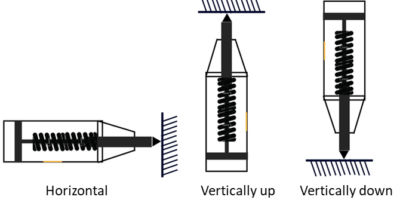
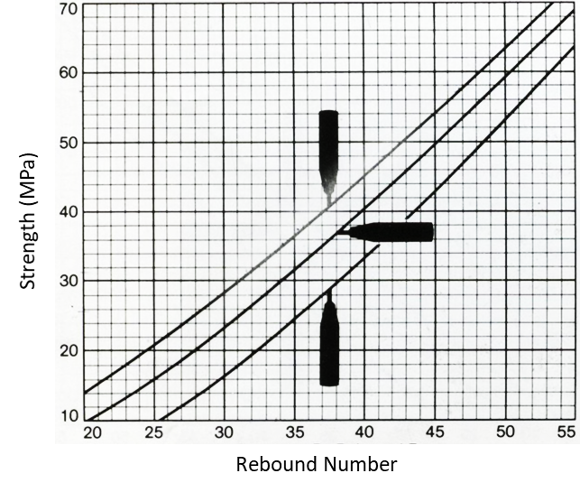

### Next these steps will be followed for determining Compressive Strength at the site using our calibrated chart
1.  For testing, smooth, clean (with abrasive stone) and dry surface should be selected. Rough surfaces resulting from incomplete compaction, loss of grout, spalled or tooled surfaces do not give reliable results and should be avoided. The point of impact should be at least 25 mm away from any edge or shape discontinuity.
 

2.  For taking a measurement, the rebound hammer should be held at right angles to the surface of the concrete member. The test can thus be conducted horizontally on vertical surfaces or vertically upwards or downwards on horizontal surfaces.
  

  

3.  Press the test hammer plunger at exactly right angles to the surface of the concrete being tested. After impact, read the rebound value.
 

4.  Take a minimum of six rebound readingsaround each point of observation with at least 20 mm distance from each other.Average of these readings after deleting outliers as per IS/ISO:16269 (2016) becomes the rebound index for the point of observation.
 
5.  Convert the rebound index to compressive strength by using the calibration chart.
  

  
The calibration chart provided by the manufacturer (Just for illustration)
  
<strong>Observations and Calculation:</strong>
 
Type of surface: Vertical / Horizontally upward / Horizontally downward:
  

<table border="1" >

    <tr  style="background-color: #000; color: #FFF;">
        <th style="text-align : center; padding:10px; width: 160px;">Serial No.</th><th style="text-align : center;padding:10px; ">Rebound value</th><th style="text-align : center;padding:10px; ">Outlier, Yes/No</th>
    </tr>

    <tr>
        <td  style="width: 160px;">1.</td><td  ></td><td ></td>
    </tr>

    <tr>
        <td style="width: 160px;">2.</td><td ></td><td ></td>
    </tr>
    <tr>
        <td style="width: 160px;">3.</td><td ></td><td ></td>
    </tr>

     <tr>
        <td style="width: 160px;">4.</td><td ></td><td ></td>
    </tr>

      <tr>
        <td style="width: 160px;">5.</td><td ></td><td ></td>
    </tr>

      <tr>
        <td style="width: 160px;">6.</td><td ></td><td ></td>
    </tr>

       <tr>
        <td style="width: 160px;">Rebound Index (average after removing outliers)</td><td ></td><td ></td>
    </tr>
</table>
 
Compressive strength based on rebound index: ______________
  

<strong>Results:</strong> 
1.  Date/period of testing:______________ 
2.  Identification of the concrete structure:______________ 
3.  Location of test area:______________ 
4.  Identification of the rebound hammer:______________ 
5.  Details of concrete and its condition:______________ 
6.  Date/time of performance of the test:______________ 
7.  Hammer orientation:______________ 
8.  Rebound Index:______________ 
9.  Compressive strength:______________
  

<strong>Precautions:</strong> 
1.  The test surface should be smooth, clean and dry. 
2.  Very high readings may be caused by rock or steel near the surface at the point of impact, and very low readings may be caused by trapped air pockets near the surface at the point of impact. 
3.  Rebound hammer test should not be conducted on rough surfaces as a result of incomplete compaction, loss of grout, spalled or tooled concrete surface. 
4.  For better accuracy correlation between rebound number and strength for a particular concrete and particular apparatus should be established. 
5.  Rebound hammer should not be used over the same points more than once. 

