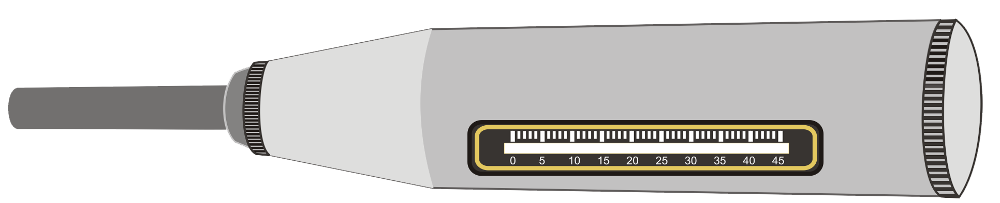
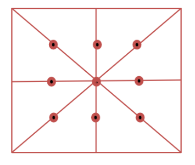

<strong> Introduction</strong>
 
<strong>Background:</strong> 
 In an actual structure on site, it is not always possible to estimate the strength of concrete directly. Some estimates of the quality of concrete as well as of the uniformity of casting of a structure can, however be obtained by non-destructive techniques such as rebound hammer test and ultra-sonic pulse velocity (UPV) tests. Rebound hammer as shown in the figure below, also called Schmidt Hammer, measures the hardness of a material surface by measuring the rebound of a standard mass after an elastic impact against the surface. The mass is released from a standard pre-compressed spring, thus having a fixed amount of energy. The distance travelled by the mass after this elastic impact expressed as a percentage of the original distance is termed as the rebound number. The rebound number gives a reasonable estimate of the strength with the help of suitable correlations between the rebound number and strength. The impact energy required for rebound hammers for different applications related to concrete structures is given in the following table.
  

    

<table style="text-align: center;">
    <tr  style="background-color: #000; color: #FFF;">
        <th style="text-align : center; padding:10px;">Serial No.</th>
        <th style="text-align : center;padding:10px; ">Application</th>
        <th style="text-align : center;padding:10px; ">Approximate Impact Energy Required for the Rebound Hammer, Nm</th>
    </tr>
    <tr>
        <td  style="padding: 10px;">A</td>
        <td  style="padding: 10px;">For Testing normal weight concrete</td>
        <td style="padding: 10px;">2.25</td>
    </tr>
    <tr>
        <td style="padding: 10px;">B</td>
        <td style="padding: 10px;">For light-weight concrete or small and impact sensitive part of concrete</td>
        <td style="padding: 10px;">0.75</td>
    </tr>
    <tr>
        <td style="padding: 10px;">C</td>
        <td style="padding: 10px;">For testing mass concrete, for examples in roads, air- fields pavements and hydraulic structures</td>
        <td style="padding: 10px;">30.00</td>
    </tr>
</table>

  
The rebound hammer method could be used for:

i)  Assessing the likely compressive strength of concrete,

ii) Assessing the uniformity of quality of a built-up structure,

iii) Assessing the development of strength with time of the same specimen,

iv) Assessing the probable damage caused by corrosive environment on concrete, etc.

In general, the rebound number increases as the strength increases but it is affected by several factors like types of cement and aggregate, surface condition and moisture content, curing and age of concrete, extent of carbonation of concrete, etc. Rebound number is indicative of the compressive strength of concrete up to a limited depth from the surface. If the concrete in a particular member has internal micro-cracking, flaws or heterogeneity across the cross-section, rebound hammer indices will not indicate the same.

Rebound hammer indices will not indicate the same. As such, the estimation of strength of concrete by rebound hammer method cannot be held to be very accurate and probable accuracy of prediction of concrete strength in a structure can be up to &#177; 25% depending upon correlation curve and methodology adopted for establishing correlation between rebound number and likely compressive strength. If the relationship between rebound number and compressive strength can be checked by tests on core samples obtained from the structure or standard specimens made with the same concrete materials and mix proportion, then the accuracy of results and confidence thereon are greatly increased.

Because of the various limitations in rebound hammer test, the combined use of ultrasonic pulse velocity (UPV) test and rebound hammer test is must for proper interpretation. If the quality of concrete assessed by ultrasonic pulse velocity method is excellent/good, only then the in-situ compressive strength assessed from the rebound hammer test is valid. This shall be taken as indicative of strength of concrete in the entire cross-section of the concrete member represented by both tests. In case the quality assessed by UPV is 'doubtful', the estimation of in-situ compressive strength by rebound indices shall be extended to the entire mass only based on other collateral measurements, for example, strength of site concrete cubes, cement content in the concrete or core testing. In cases the quality of concrete assessed by UPV is 'poor', no assessment of concrete strength shall be made from rebound hammer test.

<strong>Identifying outliers:</strong> 

 
An outlier is an observation that appears to be inconsistent with the rest of a given data set. In general, there may be more than one outlier at one or both ends of the data set. Outliers typically are attributable to one or more of the following causes: measurement or recording error, contamination, incorrect distributional assumption, and/or rare observations. Outliers are not necessarily bad or erroneous. They can be taken as an indication of the existence of rare phenomena that could be a reason for further investigation. However, many statistics are sensitive to the presence of outliers. For example, the sample mean, and sample standard deviation are easily influenced by the presence of even a single outlier that could subsequently lead to invalid inferences.

It can be assumed that the compressive strength of concrete follows a normal distribution (also known as Gaussian distribution). The graphical normal probability plot can be used to test the validity of the normality assumption. One or more outliers on either side of a normal data set can be detected by using a procedure known as the generalized extreme studentized deviate (GESD) many-outlier procedure.

<strong>Correlation between Compressive Strength of Concrete and Rebound Number (Using Cube Compressive Strength) </strong>
  
Relationships between rebound number and concrete strength that are provided by instrument manufacturers shall be used only to provide indications of relative concrete strength at different locations in a structure. To use this test method to estimate strength, it is necessary to establish a correlation between rebound number and strength for a particular concrete and particular apparatus by the method given below.
 
The most satisfactory way of establishing a correlation between compressive strength of concrete and its rebound number is to measure both the properties simultaneously on concrete cubes. The correlation shall be derived on project specific concrete cubes
 
Follow these Steps to establish correlation between Rebound Number and Compressive Strength
<ol> 
<li>Use cube specimens that should be wet cured for 27 days and they should be removed from wet storage and kept in the laboratory atmosphere for about 24 h before testing. Clean the surface (with abrasive stone) and dry the surface if needed.</li>
 
<li>Mark at least 9 points on the surface of sample as shown, ensuring that the points of impact must not be nearer an edge than 25 mm and should be not less than 25 mm from each other. 
 

  

  
 </li>
<li>Next the concrete cube specimens are held in a compression testing machine under a fixed load firmly.</li>
 
<li>For taking a measurement, the rebound hammer should be held at right angles to the surface of the concrete specimen. Measurements of rebound number is done using the particular hammer/hammers for which conditions are to be established and then the compressive strength is determined as per IS 516 (Part 1/Sec 1). </li>
 

<strong>Apparatus:</strong> 
 
   <table style="text-align: center;">
    <tr style="background-color: #000; color: #FFF;">
        <th style="text-align : center; padding:10px;">Name</th>
        <th style="text-align : center; padding:10px; ">Accuracy/Least count</th>
    </tr>
    <tr>
        <td  style="padding: 10px;">Rebound Hammer</td>
        <td  style="padding: 10px;">___________________________________</td>
    </tr>
    <tr>
        <td style="padding: 10px;">Abrasive Stone</td><td style="padding: 10px;">Medium-grain texture silicon carbide or equivalent material</td>
    </tr>
</table>
